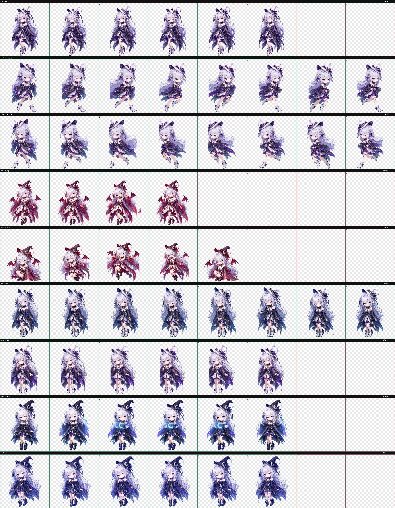

# 朔璃 / Soli — 月蚀魔女 · Codex 桌面宠物

**朔璃 / Soli the Eclipse Witch** — 平时白月陪伴，工作进入负片月蚀，高能切换赤蚀形态。

---

## 三形态


| 形态 | 名称 | 触发 |
|------|------|------|
| 🤍 白月 | 白月朔璃 | 待机 / 安静陪伴 |
| 💜 负月 | 负月朔璃 | Codex 工作中 · 双手捧月 |
| ❤️ 赤蚀 | 赤蚀朔璃 | 高能模式 · 强烈反差 |

---

## 动画预览


---

## 图集总览



---

## 安装

```bash
mkdir -p ~/.codex/pets/soli
cp assets/pet.json assets/spritesheet.webp ~/.codex/pets/soli/
```

重启 Codex，切换宠物为 **朔璃 / Soli**。

---

## 文件结构

```text
assets/pet.json           Codex 宠物配置
assets/spritesheet.webp   图集
assets/contact-sheet.png  状态总览
previews/                  预览 GIF · 三形态对比 · 动画
docs/                      创作流程 · IP 版权指南
release/                   版本说明
```

---

## 许可

角色资产（图片、动画、名称、设定）使用 [LICENSE-SOLI.md](LICENSE-SOLI.md)。代码部分 MIT。
